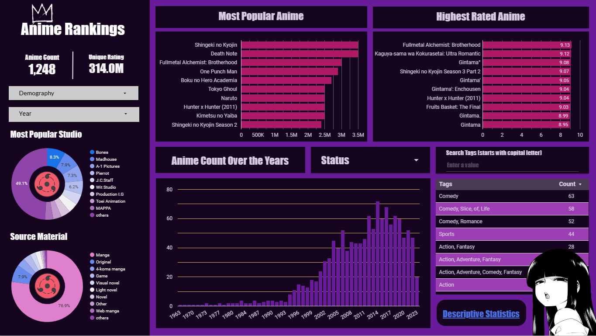

# Anime-Data-Analysis
___
## Problem Statement

Melakukan eksplorasi data anime untuk memberikan wawasan mengenai tren anime serta rekomendasi konten anime yang cocok untuk ditayangkan di platform, dengan tujuan meningkatkan jumlah subscriber Marinobar.

Selain itu saya juga membuat *interactive dashboard* menggunakan Google Looker Studio yang dapat diakses [disini]('https://lookerstudio.google.com/embed/reporting/421ffd06-04e7-4469-9483-836482c1d900/page/2QyMD'), atau dalam url dibawah.

Dashboard: https://lookerstudio.google.com/reporting/421ffd06-04e7-4469-9483-836482c1d900

## Poin Penjabaran

1. Bagaimana trend anime dari tahun ke tahun
2. Anime apa saja yang populer dan memiliki rating terbaik
3. Studio apa saja yang menghasilkan anime terpopuler dan berkualitas
4. Tema dan tag anime apa yang paling banyak
5. Bagaimana central tendency data anime untuk tiap demografi
6. Apakah ada perbedaan rating dari tiap demografi.

## Teknik yang Digunakan

1. Statistik Deskriptif
2. Statistik Inferensial (ANOVA)
3. Visualisasi Data

## Teknologi yang digunakan

1. **Python**
2. Pandas
3. Numpy
4. Matplotlib
5. Scipy
6. **Looker Studio** 

---
## Temuan

- Popularitas anime terus meningkat sepanjang tahun, sehingga anime memiliki potensi untuk meningkatkan jumlah subscriber di platform streaming Marinobar.

- Berdasarkan analisis EDA, ditemukan bahwa anime dengan demografi "Shounen" memiliki jumlah rating yang cukup tinggi, sedangkan demografi "Josei" memiliki jumlah rating yang relatif lebih rendah.

- Ditemukan juga studio-studio yang paling banyak menghasilkan anime populer dan berkualitas. Informasi ini dapat digunakan untuk mengantisipasi anime dari studio tersebut untuk ditayangkan dalam platform marinobar.

- Tema yang paling populer adalah `School`, `Shounen`, `Historical`, `Mythology`, dan `Super Power`. Tag yang paling populer adalah `comedy`, `action`, `romance`, `darama`, dan `fantasy`. tema dan tag tersebut banyak dikonsumsi oleh laki-laki muda (shounen).

- Anime dengan target demografi shounen memiliki rating terbesar, dan jumlah rating terbanyak diantara yang lainnya. Sedangkan anime untuk Kids memiliki jumlah episode terbanyak.

- Hasil uji one-way ANOVA menunjukkan bahwa terdapat perbedaan yang signifikan dalam rata-rata rating antara demografi anime "Shounen", "Seinen", "Shoujo", "Josei", dan "Kids". Hal ini dapat menjadi informasi penting dalam memilih anime apa yang cocok untuk ditayangkan di platform Marinobar.

- Dalam visualisasi menggunakan violin plot, dapat dilihat distribusi rating anime berdasarkan demografi dengan lebih detail. Violin plot menunjukkan keragaman dalam distribusi rating antara demografi anime, dengan lebar violin yang mengindikasikan densitas rating pada nilai-nilai tertentu.

## Rekomendasi

Berdasarkan hasil temuan, sebagai data analyst saya dapat direkomendasikan untuk lebih fokus dalam menayangkan anime dengan demografi "Shounen" yang memiliki jumlah rating yang cukup tinggi, serta mempertimbangkan untuk meningkatkan konten anime dengan demografi "Shoujo" yang juga memiliki anime dengan rating tinggi. Selain itu, lihat juga studio produksi anime yang berpotensi menghasilkan anime yang populer, diantaranya `Bones`, `Madhouse`, `A-1 Pictures`, dan `Toei Animation`.

